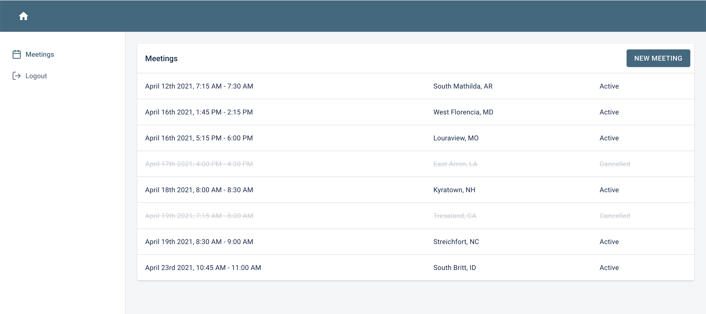
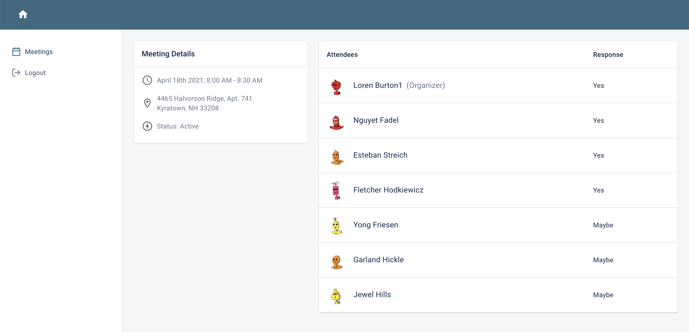

## Heroku app
  :rocket: Sign up and check it out: http://thawing-harbor-12947.herokuapp.com/

## Backend
  * Rails 6 API
  * Postgres Database
  * Token based authentication
  * Faker gem for seed data

## Frontend
  * React 17 Single Page Application
  * [Material-UI component library](https://material-ui.com/)
  * [Material UI Kit theme](https://material-ui.com/store/items/devias-kit/)
  * Redux for managing user session (synced to localStorage)
  * React Query for data fetching

## Schema
  * Users
  * Meetings
    - status [active, cancelled]
  * UserMeetings (join between User and Meetings)
    - status [yes, no, maybe]
    - role [owner, attendee]
  * [See full schema](db/schema.rb)

## :star: Bonus
  * Rails API backend + React SPA frontend deployed as a single app to Heroku
  * Full signup and login functionality
      - Protected routes
      - Token based authentication (JWT)
  * Meeting list filtering
      - Only displays meetings today and in the future
      - For meetings today that have already occurred, display as faded
  * Meeting attendee sorting
      - Organizer at the top
      - Then sort by attendance status: Yes, Maybe, No
  * Data validations
      - Meeting date range (start must be after end)
      - User meeting attendance uniqueness (can't attend a meeting twice)
      - And more!
  * UUIDs
  * Database indexes

